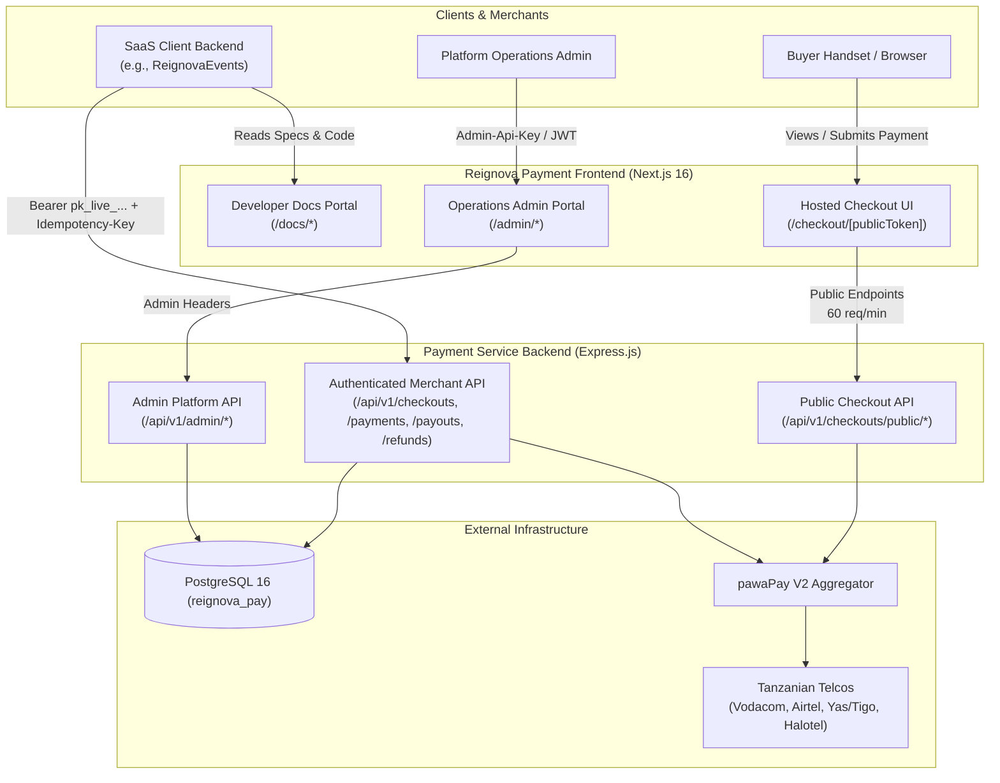

# Reignova Payment Frontend & Developer Portal

A production-grade Next.js web application providing three unified surfaces for the Reignova financial infrastructure:
1. **Interactive Developer Documentation Portal** (`/` and `/docs/*`): Comprehensive API references, architecture guides, code explorer, and webhook integration specifications.
2. **Hosted Customer Checkout** (`/checkout/[publicToken]`): High-conversion, mobile-optimized checkout interface supporting Tanzania mobile money providers (**Vodacom M-Pesa**, **Airtel Money**, **Mixx by Yas / Tigo Pesa**, and **Halotel HaloPesa**) via **pawaPay**.
3. **Platform Administration Console** (`/admin/*`): Multi-tenant merchant provisioning, live transaction monitoring, refund approvals, payout audits, and real-time operational alerts.

---

## Architecture Overview



---

## Tech Stack

- **Framework**: Next.js 16 (App Router)
- **Language**: TypeScript 5 (Strict Mode)
- **Runtime**: Node.js >= 20.0.0 / Cloudflare Pages & Workers via `@opennextjs/cloudflare`
- **Styling**: Tailwind CSS v4, PostCSS, Radix UI Primitives, `tw-animate-css`
- **Icons & Animation**: Lucide React, Framer Motion, Canvas Confetti
- **Validation**: Zod
- **Package Manager**: `pnpm` (Workspace-enabled)

---

## Key Features

### 1. Developer Documentation Portal (`/` & `/docs/*`)
- **System Overview & Guides**: Architectural introduction, sequence diagrams, and environment URLs.
- **Authentication**: Bearer API key format (`pk_live_...` / `pk_test_...`), SHA-256 peppered security, and Admin API headers.
- **Hosted Checkouts**: Server-to-server creation (`POST /api/v1/checkouts`), token handling, redirects, and session status tracking.
- **Direct Payments & Payouts**: Server-to-server STK push deposit initiation (`POST /api/v1/payments`), disbursements (`POST /api/v1/payouts`), and refunds (`POST /api/v1/refunds`).
- **Webhooks & Cryptographic Signatures**: End-to-end guide on RFC-9421 incoming signatures from pawaPay and outgoing HMAC-SHA256 signatures (`X-Payment-Signature: t=<timestamp>,v1=<sig>`) with exponential backoff retries.
- **Tanzania Mobile Money Providers**: Complete specs for Vodacom (`VODACOM_TZA`), Airtel (`AIRTEL_TZA`), Yas/Tigo (`YAS_TZA`), and Halotel (`HALOTEL_TZA`) in `TZS`.
- **Interactive API Code Explorer**: Multi-language code snippets (cURL, JavaScript, TypeScript, Python, PHP) with live error payload inspection.
- **Sandbox Testing**: Tanzanian test MSISDNs, simulated approval guidelines, and troubleshooting.

### 2. Hosted Customer Checkout (`/checkout/[publicToken]`)
- **Security by Design**: The buyer's browser only interacts with public, sanitized endpoints (`/api/v1/checkouts/public/:publicToken/*`). No API keys or internal database identifiers are exposed.
- **Intelligent Telco Selection**: Auto-predicts carrier from phone prefixes or allows explicit provider selection with brand iconography.
- **Real-time Status Polling**: Polls `/api/v1/checkouts/public/:publicToken/status` every 2.5s with exponential backoff and timeout handling.
- **Rich Status Transitions**: Smooth state transitions (`WAITING_PAYMENT` $\rightarrow$ `PROCESSING` with radar USSD animation $\rightarrow$ `COMPLETED` with celebration confetti $\rightarrow$ automatic merchant redirect).
- **Printable Receipts**: Full invoice/receipt view backed by `/api/v1/checkouts/public/:publicToken/receipt`.

### 3. Operations Admin Portal (`/admin/*`)
- **Merchant Management**: Provision SaaS tenant applications, generate live/test keys, display single-view API credentials, and manage webhooks.
- **Transaction Traceability**: Live table of checkout sessions, payments, payouts, and refund workflows.
- **Audit Logging & Security**: Scoped RBAC (`SUPER_ADMIN`, `OPERATIONS_ADMIN`, `FINANCE_ADMIN`) and immutable audit log inspection.

---

## Getting Started

### 1. Clone & Install Dependencies
```bash
git clone <repo-url>
cd reignova_payment_frontend
pnpm install
```

### 2. Configure Environment Variables
Create a `.env.local` file in the root directory:
```bash
# Payment Service Backend URL (default points to local Express backend on port 5000)
NEXT_PUBLIC_API_URL=http://localhost:5000/api/v1

# Optional override for Cloudflare or custom deployment domains
# NEXT_PUBLIC_API_URL=https://pay-api.reignovatechnologies.com/api/v1
```

### 3. Start Development Server
```bash
pnpm dev
```
Open [http://localhost:3000](http://localhost:3000) in your browser:
- **Developer Documentation**: `http://localhost:3000/docs`
- **Hosted Checkout Demo**: `http://localhost:3000/checkout/<publicToken>`
- **Admin Dashboard**: `http://localhost:3000/admin`

---

## Available Scripts

| Script | Command | Description |
| :--- | :--- | :--- |
| `dev` | `pnpm dev` | Starts Next.js development server on port 3000 |
| `build` | `pnpm build` | Compiles optimized Next.js production build |
| `start` | `pnpm start` | Runs the production Next.js Node server |
| `lint` | `pnpm lint` | Runs ESLint 9 validation |
| `preview` | `pnpm preview` | Builds and previews locally using `@opennextjs/cloudflare` |
| `deploy` | `pnpm deploy` | Builds and deploys directly to Cloudflare Pages/Workers |
| `cf-typegen` | `pnpm cf-typegen` | Generates TypeScript definitions for Cloudflare bindings |

---

## Integration with Payment Service Backend

### 1. Unified Local Development
When developing both frontend and backend on the same machine:
- **Backend API**: Runs on `http://localhost:5000` (`../reignova_pay_backend`)
- **Frontend App**: Runs on `http://localhost:3000` (`./`)
- Set `NEXT_PUBLIC_API_URL=http://localhost:5000/api/v1` in `.env.local`.

### 2. Production Reverse Proxy (Nginx)
In production on `pay.reignovatechnologies.com`:
- Nginx routes `/api/` traffic directly to the Express backend (`127.0.0.1:5000`).
- Nginx routes `/` and Next.js static assets to the frontend server (`127.0.0.1:3000` or Cloudflare).

---

## License

ISC • Reignova Technologies
